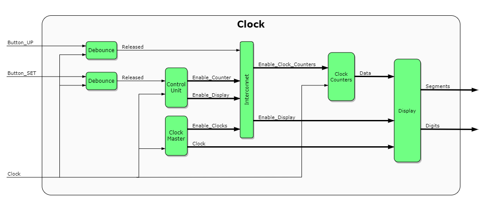

# FPGA Clock Project



Проект цифровых часов на FPGA с возможностью настройки времени через кнопки.

## Описание проекта

Этот проект реализует полнофункциональные цифровые часы с:
- Отображением времени в формате HH:MM
- 7-сегментным дисплеем с мультиплексированием
- Кнопками для настройки времени (Set, Up)
- Debouncing кнопок
- Автоматическим сбросом в 00:00 после 23:59

## Структура проекта

```
clock_on_fpga/
├── rtl/                    # Исходный код RTL
│   ├── button_debounce.v   # Модуль debounce кнопок
│   ├── counter.v           # Универсальный счетчик
│   ├── clock_master.v      # Генератор тактовых сигналов
│   ├── display.v           # 7-сегментный дисплей
│   ├── control_unit.v      # Блок управления состоянием
│   ├── clock_counters.v    # Счетчики времени
│   └── clock_top.v         # Верхний уровень системы
├── tests/                  # Тесты
│   ├── button_debounce_tb.v
│   ├── counter_tb.v
│   ├── clock_master_tb.v
│   ├── display_tb.v
│   ├── control_unit_tb.v
│   ├── clock_counters_tb.v
│   ├── clock_top_tb.v
│   ├── integration_test.v
│   └── README.md
├── Makefile               # Сборочный файл
└── README.md             # Этот файл
```

## Модули системы

### button_debounce.v
Фильтрует дребезг кнопок, обеспечивая стабильные сигналы нажатия.

### counter.v
Универсальный счетчик с параметрами ширины и значения сброса.

### clock_master.v
Генерирует различные тактовые сигналы:
- 1024Hz - для мультиплексирования дисплея
- 512Hz - для мультиплексирования дисплея
- 2Hz - для мигания цифр
- 1Hz - для мигания точки
- Enable_Clock_1Hz - импульс для подсчета секунд

### display.v
Управляет 7-сегментным дисплеем:
- Мультиплексирование 4 цифр
- BCD в 7-сегментный декодер
- Управление точкой
- Включение/выключение цифр

### control_unit.v
Конечный автомат управления режимами:
- IDLE - нормальный режим работы
- RESET_SEC - сброс секунд
- SET_MIN - настройка минут
- SET_HOUR - настройка часов

### clock_counters.v
Счетчики времени:
- Секунды (0-59)
- Минуты (0-59)
- Часы (0-23)
- Автоматический сброс в 00:00:00

### clock_top.v
Верхний уровень системы, объединяющий все модули.

## Тестирование

Проект включает comprehensive test suite для всех модулей:

### Запуск тестов
```bash
# Все тесты
make test-all

# Отдельные тесты
make test-button       # Тест debounce кнопок
make test-counter      # Тест счетчика
make test-clock-master # Тест генератора тактов
make test-display      # Тест дисплея
make test-control      # Тест блока управления
make test-counters     # Тест счетчиков времени
make test-top          # Тест верхнего уровня
make test-integration  # Интеграционный тест
```

### Тесты с waveforms
```bash
make wave-integration  # Интеграционный тест с VCD
```

## Требования

- Icarus Verilog (iverilog)
- GTKWave (для просмотра waveforms)
- Make

## Установка зависимостей

### Ubuntu/Debian
```bash
sudo apt-get install iverilog gtkwave
```

### macOS
```bash
brew install icarus-verilog gtkwave
```

### Windows
Скачайте с официальных сайтов:
- [Icarus Verilog](http://iverilog.icarus.com/)
- [GTKWave](http://gtkwave.sourceforge.net/)

## Использование

1. Клонируйте репозиторий
2. Запустите тесты: `make test-all`
3. Для отладки: `make wave-integration`

## Функциональность

### Нормальный режим
- Отображение текущего времени
- Автоматический подсчет секунд, минут, часов
- Мигающая точка между часами и минутами

### Режим настройки
- Нажатие Set: сброс секунд
- Повторное нажатие Set: настройка минут
- Третье нажатие Set: настройка часов
- Четвертое нажатие Set: возврат в нормальный режим
- Кнопка Up: инкремент текущего значения

## Особенности реализации

- Debouncing кнопок для стабильной работы
- Мультиплексирование дисплея для экономии ресурсов
- Модульная архитектура для легкого тестирования
- Comprehensive test coverage
- Автоматический сброс времени

## Статус тестов

Текущие тесты выявляют некоторые проблемы в реализации, что является нормальным для процесса разработки. Тесты помогают:
- Найти баги в коде
- Убедиться в корректности исправлений
- Документировать ожидаемое поведение
- Обеспечить регрессионное тестирование

## Разработка

Для разработки рекомендуется:
1. Запускать тесты после каждого изменения
2. Исправлять выявленные проблемы
3. Добавлять новые тесты для новых функций
4. Использовать waveforms для отладки

## Лицензия

См. файл LICENSE для деталей лицензии.